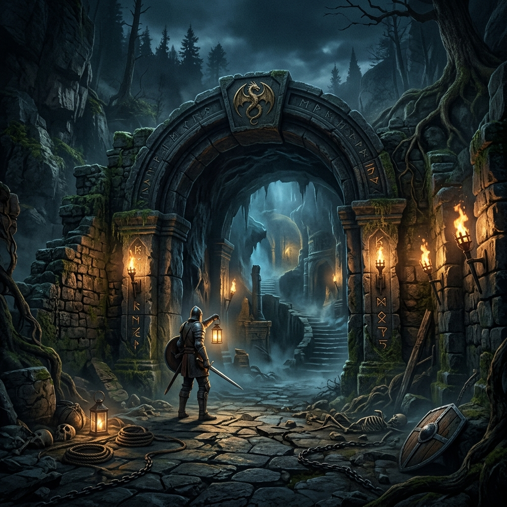

# 🐉 RPG Dungeon Explorer

¡Bienvenido a **RPG Dungeon Explorer**! Una aventura épica de exploración de mazmorras construida con las tecnologías web más modernas. Este proyecto sumerge al jugador en una serie de salas misteriosas donde la navegación, la estrategia y el descubrimiento son la clave.

## 🚀 Tecnologías Utilizadas

Este proyecto hace uso de un stack tecnológico de vanguardia para garantizar rendimiento y una experiencia de usuario fluida:

- **React 19**: Biblioteca principal para la interfaz de usuario.
- **Vite**: Herramienta de construcción para un entorno de desarrollo ultrarrápido.
- **Zustand 5**: Gestión de estado global simplificada y eficiente.
- **React Router 7**: Manejo de rutas y navegación entre páginas.
- **Tailwind CSS 4**: Estilizado moderno con un enfoque en diseño premium y responsivo.

## ✨ Características Principales

- **Exploración Dinámica**: Sistema de movimiento basado en brújula (Norte, Sur, Este, Oeste).
- **Mundo Basado en Datos**: Las salas y conexiones se gestionan dinámicamente desde un archivo `worldMap.json`.
- **Modo Oscuro/Claro**: Soporte para "Modo Calabozo" (Oscuro) y "Modo Pergamino" (Claro).
- **Página 404 Temática**: Una "Sala Extraviada" personalizada para rutas inexistentes.

## 🛠️ Mejoras e Implementaciones (Contribuciones)

Para esta fase del proyecto, se han implementado una serie de mejoras críticas que elevan la calidad del software:

### 🟢 Nivel Fácil
- **Componente RoomCard**: Refactorización de la lógica de visualización de salas en un componente atómico y reutilizable.
- **Footer Premium**: Un pie de página detallado con animaciones y créditos del proyecto.
- **Refinamiento de Estilos**: Ajustes de espaciado, tipografía (Outfit) y colores en toda la aplicación.

### 🟡 Nivel Medio
- **Historial de Movimientos**: Implementación en tiempo real de los últimos 10 pasos dados por el jugador, registrando sala, emoji y hora.
- **Navegación Robusta**: Integración total de la página 404 personalizada en el sistema de rutas.
- **Animaciones de Transición**: Efectos visuales suaves al cambiar de sala para mejorar la inmersión.

### 🔴 Nivel Avanzado
- **Dashboard de Estadísticas**: Nueva página `/stats` que calcula y muestra automáticamente:
    - Total de pasos dados.
    - Porcentaje de exploración de la mazmorra.
    - **Bitácora de Viaje**: Una interfaz visual que muestra qué salas han sido descubiertas y cuáles permanecen en las sombras.
- **Estética "Rich Aesthetics"**: Implementación de efectos de **Glassmorphism**, sombras de profundidad y gradientes dinámicos en toda la interfaz.

## 📦 Instalación y Uso

1.  Clona el repositorio.
2.  Instala las dependencias:
    ```bash
    npm install
    ```
3.  Inicia el servidor de desarrollo:
    ```bash
    npm run dev
    ```
4.  Abre tu navegador en `http://localhost:5173`.

---

**Proyecto desarrollado como parte de la asignatura de Electiva de Software.**
🐉 *Explora, Descubre, Sobrevive.*
